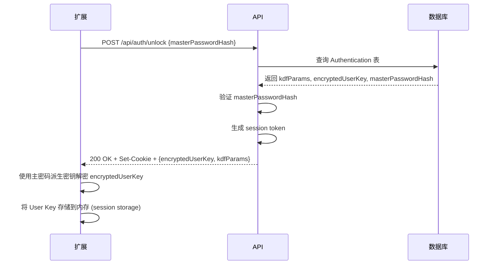

# Keeper API 规范

## 概述

Keeper 后端 API 遵循 REST 架构风格,使用 JSON 格式进行数据交换。所有 API 仅通过 HTTPS 访问,监听在 `127.0.0.1:8443`,仅允许本地 Firefox 扩展访问。

**基础信息**:
- **Base URL**: `https://127.0.0.1:8443/api`
- **协议**: HTTPS (TLS 1.3)
- **数据格式**: JSON (UTF-8)
- **认证方式**: Session Cookie (HttpOnly, Secure, SameSite=Strict)
- **错误格式**: RFC 7807 Problem Details

## 通用约定

### HTTP 方法语义

| 方法 | 用途 | 幂等性 | 安全性 |
|------|------|--------|--------|
| GET | 查询资源 | ✅ | ✅ |
| POST | 创建资源 | ❌ | ❌ |
| PUT | 完整更新资源 | ✅ | ❌ |
| PATCH | 部分更新资源 | ❌ | ❌ |
| DELETE | 删除资源 | ✅ | ❌ |

### HTTP 状态码

| 状态码 | 含义 | 使用场景 |
|--------|------|----------|
| 200 OK | 成功 | GET/PUT/PATCH/DELETE 成功 |
| 201 Created | 已创建 | POST 成功创建资源 |
| 204 No Content | 无内容 | DELETE 成功但无返回数据 |
| 400 Bad Request | 请求错误 | 参数验证失败、格式错误 |
| 401 Unauthorized | 未认证 | 未登录或 session 过期 |
| 403 Forbidden | 无权限 | 主密码验证失败 |
| 404 Not Found | 资源不存在 | ID 不存在 |
| 409 Conflict | 冲突 | 唯一性约束冲突 (如标签名重复) |
| 422 Unprocessable Entity | 无法处理 | 业务逻辑验证失败 |
| 500 Internal Server Error | 服务器错误 | 未捕获的异常 |

### 通用请求头

```http
Content-Type: application/json; charset=utf-8
Accept: application/json
User-Agent: Keeper-Firefox/1.0.0
```

### 通用响应头

```http
Content-Type: application/json; charset=utf-8
X-Content-Type-Options: nosniff
X-Frame-Options: DENY
Strict-Transport-Security: max-age=31536000; includeSubDomains
```

### 错误响应格式 (RFC 7807)

```json
{
  "type": "https://keeper.local/errors/validation-failed",
  "title": "请求参数验证失败",
  "status": 400,
  "detail": "name 字段不能为空",
  "instance": "/api/bookmarks",
  "errors": [
    {
      "field": "name",
      "message": "不能为空",
      "code": "required"
    }
  ]
}
```

### 分页参数 (查询字符串)

```http
GET /api/bookmarks?limit=50&offset=0&sort=-lastUsedAt
```

| 参数 | 类型 | 默认值 | 说明 |
|------|------|--------|------|
| `limit` | integer | 50 | 每页条数 (1-100) |
| `offset` | integer | 0 | 偏移量 |
| `sort` | string | `-updatedAt` | 排序字段,`-` 前缀表示降序 |

**分页响应头**:
```http
X-Total-Count: 237
X-Limit: 50
X-Offset: 0
Link: </api/bookmarks?limit=50&offset=50>; rel="next"
```

## 认证与会话管理

### 1. 初始化 (首次使用)

**端点**: `POST /api/auth/initialize`

**请求**:
```json
{
  "masterPasswordHash": "argon2id$v=19$m=65536,t=3,p=4$c2FsdA$hash_base64",
  "encryptedUserKey": "v1.AES_GCM.nonce.ciphertext.tag",
  "kdfParams": {
    "algorithm": "Argon2id",
    "memory": 65536,
    "iterations": 3,
    "parallelism": 4,
    "salt": "random_salt_base64"
  }
}
```

**字段说明**:
- `masterPasswordHash`: 主密码的 Argon2id 哈希 (服务器端验证用)
- `encryptedUserKey`: 使用主密码派生的密钥加密的 User Key
- `kdfParams`: KDF 参数,用于客户端重新派生密钥

**响应 (201 Created)**:
```json
{
  "message": "初始化成功",
  "userId": "550e8400-e29b-41d4-a716-446655440000"
}
```

**错误响应 (409 Conflict)**:
```json
{
  "type": "https://keeper.local/errors/already-initialized",
  "title": "已初始化",
  "status": 409,
  "detail": "数据库已包含认证信息,无法重复初始化"
}
```

---

### 2. 解锁 (登录)

**端点**: `POST /api/auth/unlock`

**请求**:
```json
{
  "masterPasswordHash": "argon2id$v=19$m=65536,t=3,p=4$c2FsdA$hash_base64"
}
```

**响应 (200 OK)**:
```json
{
  "message": "解锁成功",
  "encryptedUserKey": "v1.AES_GCM.nonce.ciphertext.tag",
  "kdfParams": {
    "algorithm": "Argon2id",
    "memory": 65536,
    "iterations": 3,
    "parallelism": 4,
    "salt": "random_salt_base64"
  }
}
```

**响应头**:
```http
Set-Cookie: keeper_session=session_token_here; HttpOnly; Secure; SameSite=Strict; Max-Age=3600
```

**错误响应 (403 Forbidden)**:
```json
{
  "type": "https://keeper.local/errors/invalid-master-password",
  "title": "主密码错误",
  "status": 403,
  "detail": "提供的主密码哈希与存储的不匹配"
}
```

**工作流程**:


---

### 3. 锁定 (登出)

**端点**: `POST /api/auth/lock`

**请求**: 无请求体

**响应 (204 No Content)**

**响应头**:
```http
Set-Cookie: keeper_session=; HttpOnly; Secure; SameSite=Strict; Max-Age=0
```

---

### 4. 检查会话状态

**端点**: `GET /api/auth/status`

**响应 (200 OK - 已解锁)**:
```json
{
  "locked": false,
  "sessionExpiresAt": "2026-03-06T12:00:00Z"
}
```

**响应 (401 Unauthorized - 已锁定)**:
```json
{
  "locked": true
}
```

---

## 书签管理

### 1. 获取书签列表

**端点**: `GET /api/bookmarks`

**查询参数**:
| 参数 | 类型 | 必需 | 说明 |
|------|------|------|------|
| `limit` | integer | 否 | 每页条数 (默认 50) |
| `offset` | integer | 否 | 偏移量 (默认 0) |
| `sort` | string | 否 | 排序字段 (默认 `-lastUsedAt`) |
| `tagIds` | string | 否 | 标签 ID 列表,逗号分隔 (如 `1,3,5`) |
| `search` | string | 否 | 搜索关键词 (匹配 name 或 pinyinInitials) |

**示例请求**:
```http
GET /api/bookmarks?tagIds=1,3&search=gh&limit=20&sort=-lastUsedAt
```

**响应 (200 OK)**:
```json
{
  "data": [
    {
      "id": "550e8400-e29b-41d4-a716-446655440000",
      "name": "GitHub",
      "pinyinInitials": "gh",
      "tagIds": [1, 3],
      "urls": [
        {
          "url": "https://github.com",
          "lastUsed": "2026-03-06T10:30:00Z"
        }
      ],
      "notes": "工作代码仓库",
      "accounts": [
        {
          "id": 1,
          "username": "user@example.com",
          "password": "v1.AES_GCM.nonce.ciphertext.tag",
          "relatedIds": [1, 2],
          "createdAt": "2026-01-15T08:00:00Z",
          "lastUsed": "2026-03-06T10:30:00Z"
        }
      ],
      "createdAt": "2026-01-15T08:00:00Z",
      "updatedAt": "2026-03-06T10:30:00Z",
      "lastUsedAt": "2026-03-06T10:30:00Z"
    }
  ],
  "total": 237,
  "limit": 20,
  "offset": 0
}
```

**响应头**:
```http
X-Total-Count: 237
Link: </api/bookmarks?limit=20&offset=20&tagIds=1,3&search=gh&sort=-lastUsedAt>; rel="next"
```

---

### 2. 获取单个书签

**端点**: `GET /api/bookmarks/{id}`

**路径参数**:
- `id` (string, UUID): 书签 ID

**响应 (200 OK)**:
```json
{
  "id": "550e8400-e29b-41d4-a716-446655440000",
  "name": "GitHub",
  "pinyinInitials": "gh",
  "tagIds": [1, 3],
  "urls": [
    {
      "url": "https://github.com",
      "lastUsed": "2026-03-06T10:30:00Z"
    }
  ],
  "notes": "工作代码仓库",
  "accounts": [
    {
      "id": 1,
      "username": "user@example.com",
      "password": "v1.AES_GCM.nonce.ciphertext.tag",
      "relatedIds": [1, 2],
      "createdAt": "2026-01-15T08:00:00Z",
      "lastUsed": "2026-03-06T10:30:00Z"
    }
  ],
  "createdAt": "2026-01-15T08:00:00Z",
  "updatedAt": "2026-03-06T10:30:00Z",
  "lastUsedAt": "2026-03-06T10:30:00Z"
}
```

**错误响应 (404 Not Found)**:
```json
{
  "type": "https://keeper.local/errors/resource-not-found",
  "title": "资源不存在",
  "status": 404,
  "detail": "ID 为 550e8400-e29b-41d4-a716-446655440000 的书签不存在"
}
```

---

### 3. 创建书签

**端点**: `POST /api/bookmarks`

**请求**:
```json
{
  "name": "GitHub",
  "pinyinInitials": "gh",
  "tagIds": [1, 3],
  "urls": [
    {
      "url": "https://github.com",
      "lastUsed": "2026-03-06T10:30:00Z"
    }
  ],
  "notes": "工作代码仓库",
  "accounts": [
    {
      "username": "user@example.com",
      "password": "v1.AES_GCM.nonce.ciphertext.tag",
      "relatedIds": [1, 2]
    }
  ]
}
```

**字段验证规则**:
| 字段 | 类型 | 必需 | 验证规则 |
|------|------|------|----------|
| `name` | string | ✅ | 1-200 字符,非空 |
| `pinyinInitials` | string | 否 | 0-50 字符,小写字母 |
| `tagIds` | array<integer> | 否 | 每个 ID 必须存在于 Tag 表 |
| `urls` | array<object> | 否 | 每个 url 字段必须是有效 URL |
| `notes` | string | 否 | 0-5000 字符 |
| `accounts` | array<object> | 否 | - |
| `accounts[].username` | string | ✅ | 1-200 字符 |
| `accounts[].password` | string | ✅ | 必须是 `v1.AES_GCM.*` 格式 |
| `accounts[].relatedIds` | array<integer> | 否 | 每个 ID 必须存在于 Relation 表 |

**响应 (201 Created)**:
```json
{
  "id": "550e8400-e29b-41d4-a716-446655440000",
  "name": "GitHub",
  "pinyinInitials": "gh",
  "tagIds": [1, 3],
  "urls": [
    {
      "url": "https://github.com",
      "lastUsed": "2026-03-06T10:30:00Z"
    }
  ],
  "notes": "工作代码仓库",
  "accounts": [
    {
      "id": 1,
      "username": "user@example.com",
      "password": "v1.AES_GCM.nonce.ciphertext.tag",
      "relatedIds": [1, 2],
      "createdAt": "2026-03-06T10:30:00Z",
      "lastUsed": "2026-03-06T10:30:00Z"
    }
  ],
  "createdAt": "2026-03-06T10:30:00Z",
  "updatedAt": "2026-03-06T10:30:00Z",
  "lastUsedAt": "2026-03-06T10:30:00Z"
}
```

**响应头**:
```http
Location: /api/bookmarks/550e8400-e29b-41d4-a716-446655440000
```

**错误响应 (422 Unprocessable Entity)**:
```json
{
  "type": "https://keeper.local/errors/validation-failed",
  "title": "验证失败",
  "status": 422,
  "detail": "标签 ID 99 不存在",
  "errors": [
    {
      "field": "tagIds[1]",
      "message": "引用的标签不存在",
      "code": "foreign_key_violation"
    }
  ]
}
```

---

### 4. 更新书签

**端点**: `PUT /api/bookmarks/{id}`

**请求**: 与创建相同,但所有字段必需 (完整替换)

**响应 (200 OK)**: 返回更新后的完整书签对象

---

### 5. 部分更新书签

**端点**: `PATCH /api/bookmarks/{id}`

**请求** (仅更新 name 和 notes):
```json
{
  "name": "GitHub (Work)",
  "notes": "公司项目专用"
}
```

**响应 (200 OK)**: 返回更新后的完整书签对象

---

### 6. 删除书签

**端点**: `DELETE /api/bookmarks/{id}`

**响应 (204 No Content)**

**错误响应 (404 Not Found)**: 如果 ID 不存在

---

### 7. 更新最后使用时间

**端点**: `POST /api/bookmarks/{id}/use`

**请求**:
```json
{
  "url": "https://github.com",
  "accountId": 1
}
```

**字段说明**:
- `url` (可选): 如果提供,更新该 URL 的 `lastUsed`
- `accountId` (可选): 如果提供,更新该账号的 `lastUsed`

**响应 (200 OK)**:
```json
{
  "message": "已更新使用时间",
  "lastUsedAt": "2026-03-06T11:00:00Z"
}
```

**副作用**:
- 更新书签的 `lastUsedAt` 字段
- 如果提供 `url`,更新 `urls` 数组中对应条目的 `lastUsed`
- 如果提供 `accountId`,更新 `accounts` 数组中对应条目的 `lastUsed`

---

## 标签管理

### 1. 获取标签列表

**端点**: `GET /api/tags`

**查询参数**:
| 参数 | 类型 | 必需 | 说明 |
|------|------|------|------|
| `sort` | string | 否 | 排序字段 (默认 `name`) |

**响应 (200 OK)**:
```json
{
  "data": [
    {
      "id": 1,
      "name": "工作",
      "color": "#FF5733",
      "icon": "work",
      "createdAt": "2026-01-10T08:00:00Z",
      "updatedAt": "2026-01-10T08:00:00Z"
    },
    {
      "id": 2,
      "name": "个人",
      "color": "#3498DB",
      "icon": "person",
      "createdAt": "2026-01-10T08:05:00Z",
      "updatedAt": "2026-01-10T08:05:00Z"
    }
  ],
  "total": 2
}
```

---

### 2. 获取单个标签

**端点**: `GET /api/tags/{id}`

**响应 (200 OK)**:
```json
{
  "id": 1,
  "name": "工作",
  "color": "#FF5733",
  "icon": "work",
  "createdAt": "2026-01-10T08:00:00Z",
  "updatedAt": "2026-01-10T08:00:00Z"
}
```

---

### 3. 创建标签

**端点**: `POST /api/tags`

**请求**:
```json
{
  "name": "工作",
  "color": "#FF5733",
  "icon": "work"
}
```

**字段验证规则**:
| 字段 | 类型 | 必需 | 验证规则 |
|------|------|------|----------|
| `name` | string | ✅ | 1-50 字符,唯一 |
| `color` | string | 否 | 7 字符 HEX 颜色码 (如 `#FF5733`) |
| `icon` | string | 否 | 1-50 字符 |

**响应 (201 Created)**:
```json
{
  "id": 3,
  "name": "工作",
  "color": "#FF5733",
  "icon": "work",
  "createdAt": "2026-03-06T10:30:00Z",
  "updatedAt": "2026-03-06T10:30:00Z"
}
```

**错误响应 (409 Conflict)**:
```json
{
  "type": "https://keeper.local/errors/duplicate-resource",
  "title": "资源重复",
  "status": 409,
  "detail": "名为 '工作' 的标签已存在"
}
```

---

### 4. 更新标签

**端点**: `PUT /api/tags/{id}`

**请求**:
```json
{
  "name": "工作项目",
  "color": "#E74C3C",
  "icon": "briefcase"
}
```

**响应 (200 OK)**: 返回更新后的标签对象

---

### 5. 删除标签

**端点**: `DELETE /api/tags/{id}`

**查询参数**:
| 参数 | 类型 | 必需 | 说明 |
|------|------|------|------|
| `cascade` | boolean | 否 | 是否级联删除 (默认 false) |

**行为**:
- `cascade=false` (默认): 如果有书签引用该标签,返回 409 错误
- `cascade=true`: 删除标签,并从所有书签的 `tagIds` 数组中移除该 ID

**响应 (204 No Content)**

**错误响应 (409 Conflict - cascade=false)**:
```json
{
  "type": "https://keeper.local/errors/constraint-violation",
  "title": "约束冲突",
  "status": 409,
  "detail": "标签被 15 个书签引用,无法删除。使用 cascade=true 强制删除。"
}
```

---

## 关联管理

### 1. 获取关联列表

**端点**: `GET /api/relations`

**响应 (200 OK)**:
```json
{
  "data": [
    {
      "id": 1,
      "name": "手机号",
      "type": "phone",
      "createdAt": "2026-01-10T08:00:00Z",
      "updatedAt": "2026-01-10T08:00:00Z"
    },
    {
      "id": 2,
      "name": "邮箱",
      "type": "email",
      "createdAt": "2026-01-10T08:05:00Z",
      "updatedAt": "2026-01-10T08:05:00Z"
    }
  ],
  "total": 2
}
```

---

### 2. 获取单个关联

**端点**: `GET /api/relations/{id}`

**响应 (200 OK)**:
```json
{
  "id": 1,
  "name": "手机号",
  "type": "phone",
  "createdAt": "2026-01-10T08:00:00Z",
  "updatedAt": "2026-01-10T08:00:00Z"
}
```

---

### 3. 创建关联

**端点**: `POST /api/relations`

**请求**:
```json
{
  "name": "手机号",
  "type": "phone"
}
```

**字段验证规则**:
| 字段 | 类型 | 必需 | 验证规则 |
|------|------|------|----------|
| `name` | string | ✅ | 1-50 字符,唯一 |
| `type` | string | ✅ | 枚举值: `phone`, `email`, `idcard`, `other` |

**响应 (201 Created)**:
```json
{
  "id": 3,
  "name": "手机号",
  "type": "phone",
  "createdAt": "2026-03-06T10:30:00Z",
  "updatedAt": "2026-03-06T10:30:00Z"
}
```

---

### 4. 更新关联

**端点**: `PUT /api/relations/{id}`

**请求**:
```json
{
  "name": "主手机号",
  "type": "phone"
}
```

**响应 (200 OK)**: 返回更新后的关联对象

---

### 5. 删除关联

**端点**: `DELETE /api/relations/{id}`

**查询参数**:
| 参数 | 类型 | 必需 | 说明 |
|------|------|------|------|
| `cascade` | boolean | 否 | 是否级联删除 (默认 false) |

**行为**:
- `cascade=false` (默认): 如果有账号引用该关联,返回 409 错误
- `cascade=true`: 删除关联,并从所有账号的 `relatedIds` 数组中移除该 ID

**响应 (204 No Content)**

**错误响应 (409 Conflict - cascade=false)**:
```json
{
  "type": "https://keeper.local/errors/constraint-violation",
  "title": "约束冲突",
  "status": 409,
  "detail": "关联被 8 个账号引用,无法删除。使用 cascade=true 强制删除。"
}
```

---

## 数据导入导出

### 1. 导出所有数据

**端点**: `GET /api/export`

**查询参数**:
| 参数 | 类型 | 必需 | 说明 |
|------|------|------|------|
| `format` | string | 否 | 导出格式: `json` (默认), `csv` |

**响应 (200 OK - JSON 格式)**:
```json
{
  "version": "1.0.0",
  "exportedAt": "2026-03-06T11:00:00Z",
  "bookmarks": [...],
  "tags": [...],
  "relations": [...]
}
```

**响应头 (JSON)**:
```http
Content-Type: application/json; charset=utf-8
Content-Disposition: attachment; filename="keeper-export-2026-03-06.json"
```

**响应头 (CSV)**:
```http
Content-Type: text/csv; charset=utf-8
Content-Disposition: attachment; filename="keeper-export-2026-03-06.csv"
```

---

### 2. 导入数据

**端点**: `POST /api/import`

**请求 (multipart/form-data)**:
```http
Content-Type: multipart/form-data; boundary=----WebKitFormBoundary

------WebKitFormBoundary
Content-Disposition: form-data; name="file"; filename="keeper-export.json"
Content-Type: application/json

{...}
------WebKitFormBoundary--
```

**查询参数**:
| 参数 | 类型 | 必需 | 说明 |
|------|------|------|------|
| `merge` | boolean | 否 | 是否合并 (默认 false,覆盖) |

**响应 (200 OK)**:
```json
{
  "message": "导入成功",
  "imported": {
    "bookmarks": 237,
    "tags": 15,
    "relations": 8
  },
  "skipped": {
    "bookmarks": 3,
    "tags": 0,
    "relations": 0
  },
  "errors": []
}
```

---

## 统计信息

### 1. 获取概览统计

**端点**: `GET /api/stats`

**响应 (200 OK)**:
```json
{
  "totalBookmarks": 237,
  "totalTags": 15,
  "totalRelations": 8,
  "totalAccounts": 312,
  "mostUsedTags": [
    {
      "id": 1,
      "name": "工作",
      "count": 89
    },
    {
      "id": 3,
      "name": "个人",
      "count": 67
    }
  ],
  "recentlyUsed": [
    {
      "id": "550e8400-e29b-41d4-a716-446655440000",
      "name": "GitHub",
      "lastUsedAt": "2026-03-06T10:30:00Z"
    }
  ]
}
```

---

## 速率限制

**限制规则**:
- 未认证请求: 10 次/分钟 (仅 `/api/auth/unlock` 和 `/api/auth/initialize`)
- 已认证请求: 1000 次/分钟

**响应头**:
```http
X-RateLimit-Limit: 1000
X-RateLimit-Remaining: 987
X-RateLimit-Reset: 1709725200
```

**超限响应 (429 Too Many Requests)**:
```json
{
  "type": "https://keeper.local/errors/rate-limit-exceeded",
  "title": "请求过于频繁",
  "status": 429,
  "detail": "已超过速率限制,请 38 秒后重试",
  "retryAfter": 38
}
```

---

## CORS 配置

```http
Access-Control-Allow-Origin: moz-extension://{extension-uuid}
Access-Control-Allow-Methods: GET, POST, PUT, PATCH, DELETE, OPTIONS
Access-Control-Allow-Headers: Content-Type, Authorization
Access-Control-Allow-Credentials: true
Access-Control-Max-Age: 86400
```

**说明**:
- 仅允许本地 Firefox 扩展访问
- 扩展 UUID 在初始化时动态配置
- 支持 Cookie 传递 (session 认证)

---

## 安全考虑

### 1. 敏感数据处理

**客户端加密字段** (服务器永不解密):
- `bookmarks.accounts[].password`
- `bookmarks.notes` (如果包含敏感信息)

**服务器明文字段** (用于查询和排序):
- `bookmarks.name`
- `bookmarks.pinyinInitials`
- `tags.name`
- `relations.name`

### 2. 请求日志

**记录内容**:
- 请求方法、路径、状态码
- 请求时间戳、响应时间
- 客户端 IP (127.0.0.1)

**不记录内容**:
- 请求/响应 body (包含加密密码)
- Cookie 值 (session token)

### 3. SQL 注入防护

- 使用参数化查询 (SQLAlchemy ORM)
- 禁止拼接 SQL 字符串

### 4. XSS 防护

- 响应头设置 `X-Content-Type-Options: nosniff`
- JSON 响应自动转义特殊字符

---

## 版本兼容性

### API 版本策略

**当前版本**: `v1` (隐含在 `/api` 路径中)

**未来版本**: 
- 不兼容变更: 新路径 `/api/v2`
- 兼容变更: 增加字段、新端点 (无需版本号变更)

**弃用流程**:
1. 新版本发布后,旧版本保持 6 个月兼容期
2. 响应头添加 `Deprecation: true` 和 `Sunset: 2026-09-06T00:00:00Z`
3. 兼容期结束后,旧版本返回 410 Gone

---

## 客户端示例

### JavaScript (Firefox 扩展)

```javascript
class KeeperAPIClient {
  constructor(baseURL = 'https://127.0.0.1:8443/api') {
    this.baseURL = baseURL;
  }

  async request(method, path, body = null) {
    const options = {
      method,
      headers: {
        'Content-Type': 'application/json',
        'Accept': 'application/json',
      },
      credentials: 'include',  // 发送 Cookie
    };

    if (body) {
      options.body = JSON.stringify(body);
    }

    const response = await fetch(`${this.baseURL}${path}`, options);

    if (!response.ok) {
      const error = await response.json();
      throw new APIError(error);
    }

    if (response.status === 204) {
      return null;  // No Content
    }

    return response.json();
  }

  // 认证
  async unlock(masterPasswordHash) {
    return this.request('POST', '/auth/unlock', { masterPasswordHash });
  }

  async lock() {
    return this.request('POST', '/auth/lock');
  }

  // 书签
  async getBookmarks(filters = {}) {
    const query = new URLSearchParams(filters).toString();
    return this.request('GET', `/bookmarks?${query}`);
  }

  async createBookmark(bookmark) {
    return this.request('POST', '/bookmarks', bookmark);
  }

  async updateBookmark(id, bookmark) {
    return this.request('PUT', `/bookmarks/${id}`, bookmark);
  }

  async deleteBookmark(id) {
    return this.request('DELETE', `/bookmarks/${id}`);
  }

  async markBookmarkAsUsed(id, { url, accountId }) {
    return this.request('POST', `/bookmarks/${id}/use`, { url, accountId });
  }

  // 标签
  async getTags() {
    return this.request('GET', '/tags');
  }

  async createTag(tag) {
    return this.request('POST', '/tags', tag);
  }

  async deleteTag(id, cascade = false) {
    return this.request('DELETE', `/tags/${id}?cascade=${cascade}`);
  }
}

class APIError extends Error {
  constructor(errorResponse) {
    super(errorResponse.detail);
    this.type = errorResponse.type;
    this.status = errorResponse.status;
    this.errors = errorResponse.errors || [];
  }
}

// 使用示例
const client = new KeeperAPIClient();

try {
  await client.unlock('argon2id$v=19$...');
  
  const { data: bookmarks } = await client.getBookmarks({
    tagIds: '1,3',
    search: 'github',
    limit: 20
  });

  console.log(bookmarks);
} catch (error) {
  if (error instanceof APIError) {
    console.error(`API Error ${error.status}: ${error.message}`);
  }
}
```

---

## 测试端点 (开发环境专用)

**端点**: `GET /api/health`

**响应 (200 OK)**:
```json
{
  "status": "healthy",
  "version": "1.0.0",
  "database": "connected",
  "timestamp": "2026-03-06T11:00:00Z"
}
```

**生产环境**: 该端点返回 404 (安全考虑)

---

## 变更日志

### v1.0.0 (2026-03-06)
- 初始 API 设计
- 支持书签、标签、关联的完整 CRUD
- 基于 session cookie 的认证
- 零知识加密架构

### 未来计划
- v1.1.0: 添加书签分组功能
- v1.2.0: 支持浏览器历史记录同步
- v2.0.0: 迁移到 JWT 认证 (如需支持多客户端)
